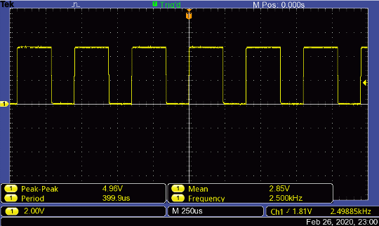
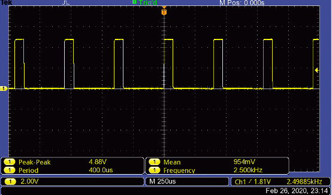

The aim of this was to be able to control an LED with a potentiometer, a dsPIC30F4011 and the MPLAB X IDE for my Microcontroller Application Group Lab (MAGL) module at university.
## The Task
The aim of the task was to turn an LED on at 3.5v and off at 1.5v. This voltage was controlled through a potentiometer.

## Procedure
Since the dsPIC30F4011 has a 10-bit resolution with a source voltage of 5 volts the equation needed to calculate the desired ADC values were: 1023/5 = ADC/(Analogue Voltage Measured)

or 

1023/5 = x / 3.5

This gave 716 (to the nearest whole number). The same was then done to get the ADC value when voltage measured was 1.5v, this was 307.

Using an if statement, the LED latch was set high when the ADC value was over 716 and let low when the ADC value was less than 307.
### Another example
Using the potentiometer to control the PWM signal to an LED.

Using the same techniques learnt above, the PDC can be set to = (potentiometer * (PTPER/1023)).
adjusting the potentiometer then gave the PMW signal:

and 

### Future Works
The skills gained in from this project went on to be used to a read sensor data in small robot built to complete in a micromouse-style challenge.
